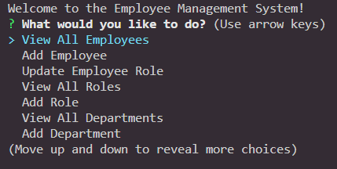

# <Employee-Tracker>

## Description

This project aims to provide a simple management system for employees in the command line. Using MySQL2, we are able to connect to the local MySQL database and run queries on it, allowing us to edit data. It also uses inquirer to create a simple to follow interface with prompts for the user.

## Installation

- Clone the GitHub Repository
- Install dependencies with npm install in terminal
- Run schema.sql
- Optionally, fill in with sample data with seeds.sql

## Usage
Run the program with either `npm start` or `node index.js` and follow the prompts

[Click here for a demo video](https://watch.screencastify.com/v/xonIpANleKQGz0vFDEjh)

## Credits

## License

Please see license in GitHub repository.